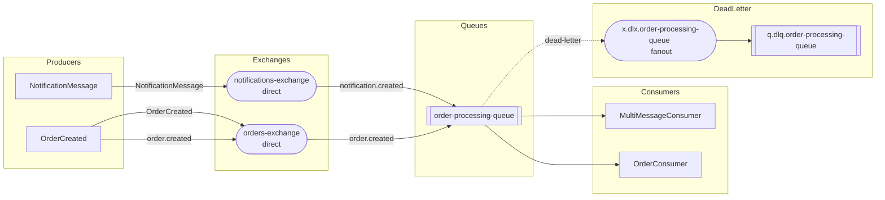

# Carotte.DocCli 🥕📖

`Carotte.DocCli` est un outil en ligne de commande permettant de générer automatiquement une spécification complète au format **Markdown** ou **AsyncAPI** (YAML / JSON) de la topologie de messagerie d'un microservice basé sur **Carotte**.

Il analyse les métadonnées de vos assemblies .NET compilés (producteurs marqués par `[Published]`, consommateurs implémentant `IConsumer<T>`, topologies `[Queue]` / `[Binding]` ou conventions automatiques) ainsi que les commentaires XML de documentation (`/// <summary>`) pour produire une documentation claire, vivante et synchronisée avec le code.

---

## 🚀 Fonctionnalités

- 📄 **Spécifications AsyncAPI (YAML & JSON)** : Export au standard AsyncAPI (version 3.1.0) avec les bindings AMQP (exchanges, queues, routing keys, Dead-Letter), validation de schéma et schémas JSON Schema.
- 📊 **Diagramme Mermaid interactif** : Génération automatique d'un diagramme de flux orienté (`graph LR`) visualisant les producteurs, consommateurs, échanges, files et dead-letter exchanges (DLX/DLQ).
- 📤 **Tableau des messages produits** : Liste des messages émis avec broker, échange de destination, clé de routage et type d'échange.
- 📥 **Tableau des messages consommés** : Liste des consommateurs, files d'attente, liaisons (bindings) et stratégies de résilience/erreur (retries, DLX/DLQ, requeue).
- 📋 **Contrats de données (Data Contracts)** : Schéma détaillé de chaque type de message (propriétés, types C#, descriptions extraites de la documentation XML).
- 🔄 **Intégration CI/CD & Architecture Tests** : Intégrable facilement dans vos pipelines de build ou exécutable lors de tests pour éviter toute dérive documentaire (*doc drift*).

---

## 💻 Utilisation

### Syntaxe de base

```bash
dotnet run --project Carotte.DocCli -- --assembly <chemin-vers-dll> [options]
```

Ou si l'outil est publié sous forme de binaire autonome / global tool :

```bash
carotte-doc --assembly ./bin/Release/net10.0/MyService.dll --output ./docs/MESSAGING.md
```

### Génération AsyncAPI (YAML / JSON)

```bash
# Export AsyncAPI en YAML (v3.1) avec validation
dotnet run --project Carotte.DocCli -- \
  --assembly ./bin/Release/net10.0/MyService.dll \
  --format asyncapi-yaml \
  --validate \
  --output ./docs/asyncapi.yaml

# Export AsyncAPI en JSON (v3.1)
dotnet run --project Carotte.DocCli -- \
  --assembly ./bin/Release/net10.0/MyService.dll \
  --format asyncapi-json \
  --output ./docs/asyncapi.json
```

---

## ⚙️ Options et Arguments

| Option | Alias | Description | Valeur par défaut |
| :--- | :--- | :--- | :--- |
| `--assembly` | `-a` | **(Requis)** Chemin vers l'assembly compilé (`.dll`) du microservice. | *Aucun* |
| `--output` | `-o` | Chemin du fichier à générer. Si non spécifié, le résultat est affiché sur la sortie standard (`stdout`). | *stdout* |
| `--format` | `-f` | Format de sortie : `markdown`, `asyncapi-yaml`, `asyncapi-json`. | `markdown` |
| `--title` | `-t` | Titre personnalisé pour le document généré. | `{AssemblyName} Messaging Specification` |
| `--api-version` | | Version de l'API dans le document AsyncAPI. | `1.0.0` |
| `--validate` | `-v` | Valide le document AsyncAPI généré par rapport à la spécification AsyncAPI 3.1. | `false` |
| `--xml-doc` | `-x` | Chemin vers le fichier de documentation XML généré par le compilateur C#. | Fichier `.xml` adjacent au `.dll` s'il existe |
| `--namespaces` | `-n` | Liste de namespaces (séparés par des virgules) pour restreindre le scan. | Tous les namespaces de l'assembly |
| `--no-diagram` | | Désactive la génération du diagramme Mermaid (Markdown uniquement). | `false` (diagramme inclus) |
| `--no-contracts` | | Désactive la section détaillée des contrats de données (Markdown uniquement). | `false` (contrats inclus) |
| `--help` | `-h` | Affiche l'aide et la description des commandes. | |

---

## 🔄 Intégration CI/CD

### Exemple avec GitHub Actions

Générez et validez automatiquement la documentation lors de chaque Pull Request ou mettez à jour la documentation versionnée :

```yaml
name: Generate Messaging Documentation

on:
  push:
    branches: [ main ]
  pull_request:
    branches: [ main ]

jobs:
  docs:
    runs-on: ubuntu-latest
    steps:
      - uses: actions/checkout@v4

      - name: Setup .NET
        uses: actions/setup-dotnet@v4
        with:
          dotnet-version: '10.0.x'

      - name: Build Solution
        run: dotnet build --configuration Release

      - name: Generate Messaging Docs
        run: |
          dotnet run --project Carotte.DocCli -c Release -- \
            --assembly ./src/MyService/bin/Release/net10.0/MyService.dll \
            --output ./docs/MESSAGING.md \
            --title "MyService Messaging Architecture"

      - name: Verify or Commit Documentation
        run: |
          git config --global user.name "github-actions[bot]"
          git config --global user.email "github-actions[bot]@users.noreply.github.com"
          git add docs/MESSAGING.md
          git diff --staged --quiet || (git commit -m "docs: auto-update messaging documentation [skip ci]" && git push)
```

---

## 📖 Exemple de Rendu Markdown

Voici un aperçu du rendu généré par `Carotte.DocCli` à partir d'un microservice :

````markdown
# Carotte.Sample Messaging Specification

### Architecture & Topology Diagram



### Produced Messages

| Message | Broker | Exchange | Routing Key | Exchange Type |
| :--- | :--- | :--- | :--- | :--- |
| `NotificationMessage` | - | `notifications-exchange` | `NotificationMessage` | `Direct` |
| `OrderCreated` | - | `orders-exchange` | `OrderCreated` | `Direct` |
| `OrderCreated` | - | `orders-exchange` | `order.created` | `Direct` |

### Consumed Messages

| Message | Consumer | Queue | Broker | Bindings | Error Strategy |
| :--- | :--- | :--- | :--- | :--- | :--- |
| `NotificationMessage`<br/>`OrderCreated` | `MultiMessageConsumer` | `order-processing-queue` | - | `orders-exchange` (key: `order.created`, Direct)<br/>`notifications-exchange` (key: `notification.created`, Direct) | 3 retries (default), DLX: `x.dlx.order-processing-queue` |
| `OrderCreated` | `OrderConsumer` | `order-processing-queue` | - | `orders-exchange` (key: `order.created`, Direct) | 3 retries (default), DLX: `x.dlx.order-processing-queue` |

### Data Contracts

#### `NotificationMessage`

*Represents a notification sent to a customer.*

| Property | Type | Description |
| :--- | :--- | :--- |
| `OrderId` | `Guid` | The related order identifier. |
| `Message` | `string` | The text message content. |
| `RecipientEmail` | `string` | The recipient email address. |

#### `OrderCreated`

*Represents an event triggered when a new order is placed.*

| Property | Type | Description |
| :--- | :--- | :--- |
| `OrderId` | `Guid` | The unique identifier of the created order. |
| `CustomerName` | `string` | The full name of the customer. |
| `Amount` | `decimal` | The total monetary amount for the order. |
````

---

## 🛠️ Utilisation Programmatique (C#)

Vous pouvez également intégrer la génération directement dans vos tests C# via le package `Carotte.Documentation` :

```csharp
using Carotte.Documentation;

var generator = new CarotteDocGenerator();

// Génération en chaîne Markdown
string markdown = generator.Generate(typeof(Program).Assembly, new CarotteDocumentationOptions
{
    Title = "Mon Service Messaging",
    IncludeMermaidDiagram = true,
    IncludeDataContracts = true
});

// Écriture directe dans un fichier
await generator.GenerateToFileAsync(typeof(Program).Assembly, "docs/MESSAGING.md");
```
