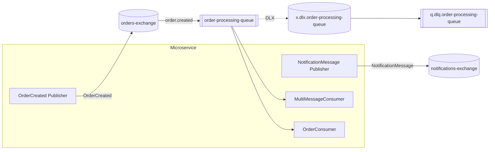

# Carotte.Sample Messaging Specification

### Messaging Topology

### Produced Messages

| Message | Broker | Exchange | Routing Key | Exchange Type |
| :--- | :--- | :--- | :--- | :--- |
| `NotificationMessage` | `my-broker` | `notifications-exchange` | `NotificationMessage` | `Direct` |
| `OrderCreated` | `my-broker` | `orders-exchange` | `OrderCreated` | `Direct` |

### Consumed Messages

| Message | Consumer | Queue | Broker | Bindings | Error Strategy |
| :--- | :--- | :--- | :--- | :--- | :--- |
| `OrderCreated` `NotificationMessage` | `MultiMessageConsumer` | `order-processing-queue` | `my-broker` | `orders-exchange` (key: `order.created`, Direct) | 3 retries, DLX: `x.dlx.order-processing-queue` |
| `OrderCreated` | `OrderConsumer` | `order-processing-queue` | `my-broker` | `orders-exchange` (key: `order.created`, Direct) | 3 retries, DLX: `x.dlx.order-processing-queue` |

### Data Contracts

#### `NotificationMessage`

*Represents a notification sent to a customer.*

| Property | Type | Description |
| :--- | :--- | :--- |
| `OrderId` | `Guid` | The related order identifier. |
| `Message` | `string` | The text message content. |
| `RecipientEmail` | `string` | The recipient email address. |

#### `OrderCreated`

*Represents an event triggered when a new order is placed.*

| Property | Type | Description |
| :--- | :--- | :--- |
| `OrderId` | `Guid` | The unique identifier of the created order. |
| `CustomerName` | `string` | The full name of the customer. |
| `Amount` | `decimal` | The total monetary amount for the order. |

