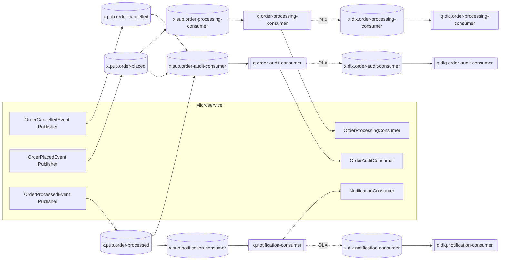

# Carotte.Sample Messaging Specification

### Messaging Topology

### Produced Messages

| Message | Broker | Exchange | Routing Key | Exchange Type |
| :--- | :--- | :--- | :--- | :--- |
| `OrderCancelledEvent` | - | `x.pub.order-cancelled` | - | `Fanout` |
| `OrderPlacedEvent` | - | `x.pub.order-placed` | - | `Fanout` |
| `OrderProcessedEvent` | - | `x.pub.order-processed` | - | `Fanout` |

### Consumed Messages

| Message | Consumer | Queue | Broker | Bindings | Error Strategy |
| :--- | :--- | :--- | :--- | :--- | :--- |
| `OrderProcessedEvent` | `NotificationConsumer` | `q.notification-consumer` | - | `x.pub.order-processed` &rarr; `x.sub.notification-consumer` | 3 retries, DLX: `x.dlx.notification-consumer` |
| `OrderPlacedEvent` `OrderProcessedEvent` `OrderCancelledEvent` | `OrderAuditConsumer` | `q.order-audit-consumer` | - | `x.pub.order-placed` &rarr; `x.sub.order-audit-consumer` `x.pub.order-processed` &rarr; `x.sub.order-audit-consumer` `x.pub.order-cancelled` &rarr; `x.sub.order-audit-consumer` | 3 retries, DLX: `x.dlx.order-audit-consumer` |
| `OrderPlacedEvent` | `OrderProcessingConsumer` | `q.order-processing-consumer` | - | `x.pub.order-placed` &rarr; `x.sub.order-processing-consumer` | 3 retries, DLX: `x.dlx.order-processing-consumer` |

### Data Contracts

#### `OrderCancelledEvent`

*Represents an event published when an order is cancelled.*

| Property | Type | Description |
| :--- | :--- | :--- |
| `OrderId` | `Guid` | The unique identifier of the cancelled order. |
| `Reason` | `string` | The cancellation reason. |
| `CancelledAt` | `DateTimeOffset` | The timestamp when the order was cancelled. |

#### `OrderPlacedEvent`

*Represents an event published when a customer places a new order.*

| Property | Type | Description |
| :--- | :--- | :--- |
| `OrderId` | `Guid` | The unique identifier of the order. |
| `CustomerId` | `Guid` | The unique identifier of the customer. |
| `CustomerEmail` | `string` | The email address of the customer. |
| `TotalAmount` | `decimal` | The total amount of the order. |
| `PlacedAt` | `DateTimeOffset` | The timestamp when the order was placed. |

#### `OrderProcessedEvent`

*Represents an event published when an order has been successfully processed.*

| Property | Type | Description |
| :--- | :--- | :--- |
| `OrderId` | `Guid` | The unique identifier of the order. |
| `CustomerId` | `Guid` | The unique identifier of the customer. |
| `CustomerEmail` | `string` | The email address of the customer. |
| `TotalAmount` | `decimal` | The total amount processed. |
| `ProcessedAt` | `DateTimeOffset` | The timestamp when the order was processed. |

