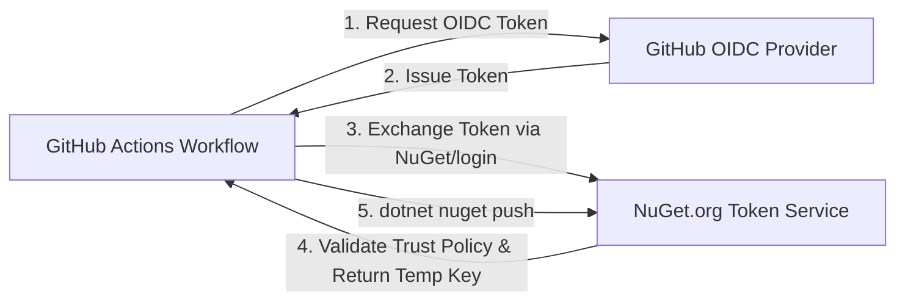

# CI/CD & Release Guide 🚀

This document details the CI/CD pipelines configured for the **Carotte** project, how **NuGet Trusted Publishing (OIDC)** works, and the step-by-step process to publish a new release.

---

## 📑 Table of Contents

- [Overview & Architecture](#overview--architecture)
  - [1. Continuous Integration (CI)](#1-continuous-integration-ci)
  - [2. Release & Continuous Deployment (CD)](#2-release--continuous-deployment-cd)
- [NuGet Trusted Publishing (OIDC)](#nuget-trusted-publishing-oidc)
  - [Why Trusted Publishing?](#why-trusted-publishing)
  - [How It Works](#how-it-works)
- [Initial Setup for Trusted Publishing](#initial-setup-for-trusted-publishing)
  - [Step 1: Configure Trusted Publishing on NuGet.org](#step-1-configure-trusted-publishing-on-nugetorg)
  - [Step 2: Configure GitHub Repository Variables](#step-2-configure-github-repository-variables)
- [How to Make a Release](#how-to-make-a-release)
  - [Method 1: Release via Git Tag (Recommended)](#method-1-release-via-git-tag-recommended)
  - [Method 2: Manual Trigger via GitHub UI](#method-2-manual-trigger-via-github-ui)
- [What Happens During a Release?](#what-happens-during-a-release)
- [Packaged Projects](#packaged-projects)
- [Local Verification Before Releasing](#local-verification-before-releasing)
- [Troubleshooting & Fallback Options](#troubleshooting--fallback-options)

---

## Overview & Architecture

The repository uses two GitHub Actions workflows located in `.github/workflows/`:

```
.github/
└── workflows/
    ├── ci.yml        # Continuous Integration (build, format, test, coverage)
    └── release.yml   # Release & CD (build, test, pack, GitHub Release, NuGet publish)
```

### 1. Continuous Integration (CI)
- **File**: `.github/workflows/ci.yml`
- **Triggers**:
  - `push` on branches `main` and `develop`
  - `pull_request` targeting `main` and `develop`
- **Actions**:
  1. Sets up .NET 10 SDK with dependency caching (`Directory.Packages.props`).
  2. Verifies code formatting (`dotnet format --verify-no-changes`).
  3. Builds the entire solution in `Release` configuration.
  4. Runs all unit and integration tests with code coverage data collection (`opencover`).
  5. Uploads test result `.trx` files as GitHub Actions artifacts.

### 2. Release & Continuous Deployment (CD)
- **File**: `.github/workflows/release.yml`
- **Triggers**:
  - `push` of tags matching `v*.*.*` (e.g. `v1.0.0`, `v1.2.3-preview.1`)
  - `workflow_dispatch` (manual run with version input)
- **Actions**:
  1. Extracts version from the Git tag or user input.
  2. Builds solution with deterministic CI properties (`-p:ContinuousIntegrationBuild=true -p:Version=...`).
  3. Executes test suite.
  4. Generates `.nupkg` and `.snupkg` (SourceLink symbols) packages.
  5. Creates a GitHub Release with auto-generated release notes and attached packages.
  6. Authenticates with **NuGet.org** using **Trusted Publishing (OIDC)** and pushes packages.
  7. Publishes packages to **GitHub Packages** if `GITHUB_TOKEN` is available.

---

## NuGet Trusted Publishing (OIDC)

### Why Trusted Publishing?
Traditional NuGet publishing requires generating a static API key on NuGet.org and storing it as a GitHub Actions secret (`NUGET_API_KEY`).
Starting in August 2026, NuGet API keys are subject to strict expiration (30 days).

**Trusted Publishing** replaces static long-lived secrets with keyless authentication via OpenID Connect (OIDC):
- **No secrets to manage or rotate**: No static API key stored in GitHub.
- **Short-lived tokens**: Temporary tokens valid for 1 hour issued only during the workflow run.
- **Strict identity scoping**: Restricted to your exact repository, workflow file, and branch/tag.

### How It Works


---

## Initial Setup for Trusted Publishing

This is a **one-time setup** to link your GitHub repository to NuGet.org.

### Step 1: Configure Trusted Publishing on NuGet.org
1. Sign in to your account on [NuGet.org](https://www.nuget.org).
2. Click your profile avatar in the upper right corner and select **Trusted Publishing** (or go to `Account Settings` → `Trusted Publishing`).
3. Click **Add policy** and fill in the following details:
   - **Policy Name**: `Carotte GitHub Actions` (or any descriptive name)
   - **Repository Owner**: Your GitHub username or organization (e.g., `Carotte` or `your-github-username`)
   - **Repository Name**: `Carotte`
   - **Workflow File**: `release.yml` *(must be the exact file name)*
   - **Environment**: *(Leave empty unless your workflow targets a specific GitHub environment)*
4. Click **Create policy**.

### Step 2: Configure GitHub Repository Variables
1. In your GitHub repository, go to **Settings** → **Secrets and variables** → **Actions** → **Variables** tab.
2. Click **New repository variable**.
3. Add:
   - **Name**: `NUGET_USER` (or `NUGET_USERNAME`)
   - **Value**: Your NuGet.org account username (profile name, **not** your email address).
4. Save the variable.

> 💡 **Note**: You do not need to create or store a `NUGET_API_KEY` secret when using Trusted Publishing.

---

## How to Make a Release

### Method 1: Release via Git Tag (Recommended)

1. Ensure all changes are merged into `main` and all CI checks pass.
2. Checkout the latest `main` branch locally:
   ```bash
   git checkout main
   git pull origin main
   ```
3. Create a semantic version tag (must start with `v`):
   ```bash
   # For a standard release:
   git tag v1.0.0

   # Or for a pre-release:
   git tag v1.0.0-preview.1
   ```
4. Push the tag to GitHub:
   ```bash
   git push origin v1.0.0
   ```
5. The `Release` workflow is automatically triggered.

---

### Method 2: Manual Trigger via GitHub UI

If you want to create a release without pushing a Git tag locally:

1. Open the repository on GitHub.
2. Go to the **Actions** tab.
3. In the left sidebar, click on **Release**.
4. Click the **Run workflow** dropdown button on the right.
5. Select the branch (e.g. `main`) and enter the desired version in the **Version to publish** field (e.g. `1.0.0` or `1.0.0-preview.1`).
6. Click **Run workflow**.

---

## What Happens During a Release?

1. **Version Extraction**:
   - Tag `v1.2.3` extracts version `1.2.3`.
   - Pre-release tags like `v1.2.3-preview.1` mark the GitHub Release as **Pre-release** automatically.
2. **Build & Test**:
   - Compiles solution in `Release` mode with SourceLink and embedded sources.
   - Executes unit and documentation tests to prevent broken releases.
3. **Packaging**:
   - Runs `dotnet pack` producing `.nupkg` and `.snupkg` artifacts with metadata from `Directory.Build.props`.
4. **GitHub Release Creation**:
   - Publishes a new GitHub Release with automatically generated changelog (PRs, contributors).
   - Attaches `.nupkg` and `.snupkg` packages as downloadable release assets.
5. **NuGet.org Publishing**:
   - `NuGet/login@v1` authenticates via OIDC and obtains a short-lived token.
   - Packages are pushed to `https://api.nuget.org/v3/index.json`.
6. **GitHub Packages Publishing**:
   - Packages are published to `https://nuget.pkg.github.com/<owner>/index.json`.

---

## Packaged Projects

Only production and consumer-facing packages are packaged during release:

| Project | NuGet Package ID | Description |
|---|---|---|
| `Carotte` | `Carotte` | Core RabbitMQ wrapper & runtime |
| `Carotte.Documentation` | `Carotte.Documentation` | AsyncAPI documentation & topology generator |
| `Carotte.TestKit` | `Carotte.TestKit` | Test utilities and mocks for Carotte |

The following non-distributable projects have `<IsPackable>false</IsPackable>`:
- `Carotte.Benchmarks`
- `Carotte.DocCli`
- `Carotte.Sample`
- All test projects (`*.Tests`)

---

## Local Verification Before Releasing

Before tagging a release, you can verify everything locally:

```bash
# 1. Build in Release mode
dotnet build Carotte.slnx --configuration Release

# 2. Run tests
dotnet test Carotte.slnx --configuration Release --no-build

# 3. Test packaging into a local folder
dotnet pack Carotte.slnx --configuration Release --no-build --output ./artifacts -p:PackageVersion=1.0.0

# 4. Check generated packages
Get-ChildItem ./artifacts/
```

---

## Troubleshooting & Fallback Options

### 1. Token exchange failed (401) on `NuGet/login`
- **Cause**: NuGet.org trust policy does not match the GitHub repository, owner, or workflow file.
- **Fix**: Verify in NuGet.org Trusted Publishing settings that:
  - Repository Owner matches your GitHub owner / username.
  - Repository matches `Carotte`.
  - Workflow file is exactly `release.yml`.
  - `NUGET_USER` variable in GitHub matches your NuGet profile username (not email).

### 2. Legacy API Key Fallback
The `release.yml` workflow retains fallback compatibility with static API keys:
- If Trusted Publishing is not configured, you can set a repository secret named `NUGET_API_KEY`.
- The workflow will automatically fallback to using `NUGET_API_KEY` to publish to NuGet.org.
